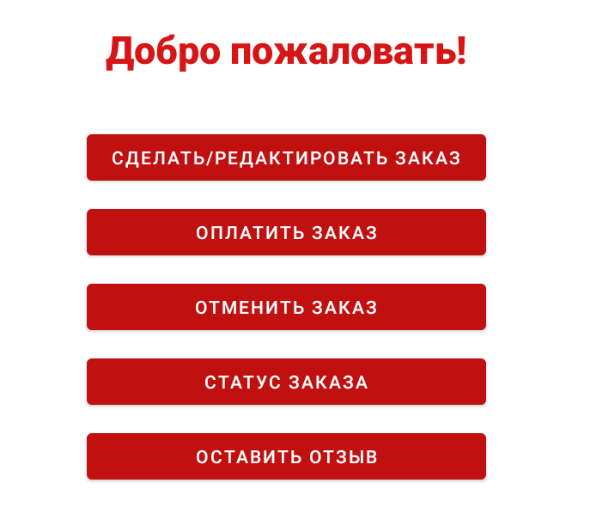
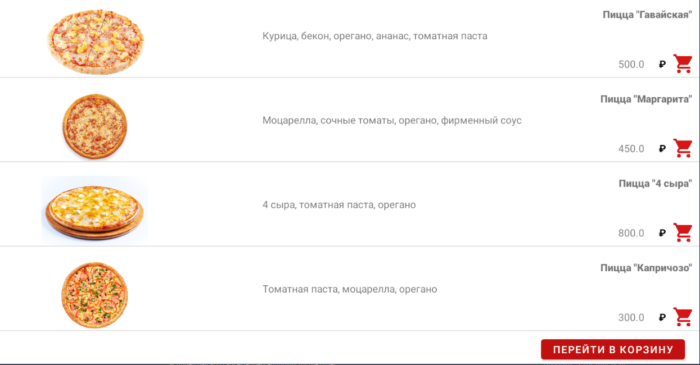
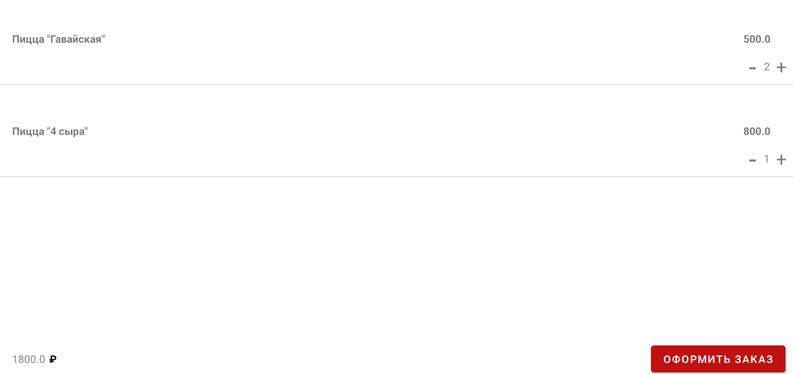
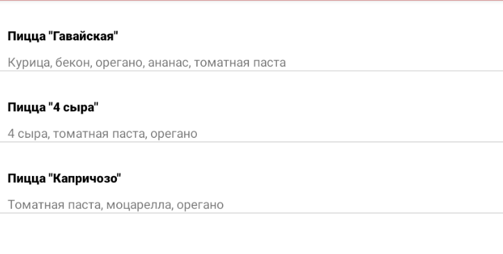
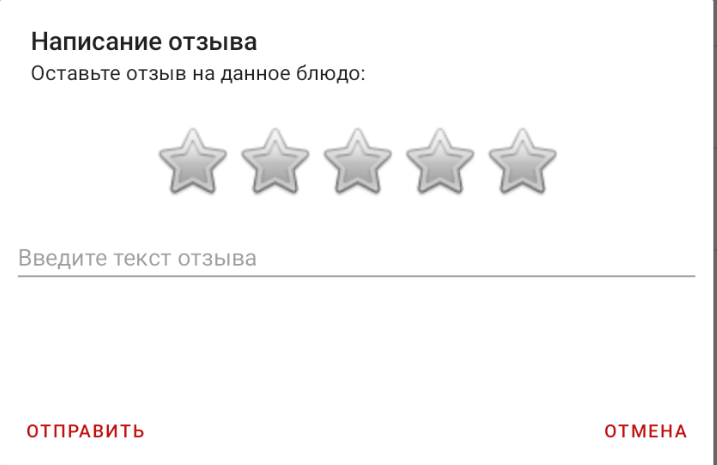

# Приложение RestaurantApp
## Краткое описание
Мое приложение RestaurantApp разработано для использования на платформе Android  
Приложение состоит из серверной и клиентской части.
## Установка
Установка и настройка приложения описана в файле INSTALL.md
## Техническое описание
Техническая информация о приложении описана в файле INFO.md
## Функционал
В клиентской части реализованы следующие функции:
- регистрация пользователей (посетителей и администраторов)
- авторизация ранее зарегистрированных пользователей (посетителей и администраторов)  
### Для администраторов доступны следующие функции:
- добавление, удаление и редактирование позиций меню (кнопка "Меню")
- статистика (кнопка "Статистика"), которая позволяет администратору узнать
  - сумму выручки за указанный период
  - количество заказов за указанный период
  - рейтинг блюд
  - самое популярное блюдо
  - отзывы, которые были оставлены
- изменение уровня доступа пользователей
### Для пользователей доступны следующие функции:
- оформление заказа
- отмена заказа
- редактирование заказа
- оплата заказа
- проверка статуса заказа
- возможность оставить отзыв о заказанных ранее блюдах.
### Рассмотрим перечисленные выше функции подробнее:
Чтобы зарегистрироваться в приложении, новый пользователь должен нажать на ссылку "Нет аккаунта? Зарегистрируйтесь".  

По нажатию на ссылку откроется окно регистрации, в котором пользователь должен указать ФИО (опционально), 
логин (обязательно), пароль (обязательно).

После ввода указанной информации пользователь должен нажать на кнопку "Зарегистрироваться".
Первый пользователь автоматически получает права администратора.
Остальные пользователи автоматически получают права посетителей, которые администратор может изменить на права администратора
по своему усмотрению (см. ниже).

Зарегистрированный пользователь может зайти в приложение с соответствующими правами, указав свой логин и пароль (см. рисунок выше, вкладка "Вход").
На длину логина и пароля ограничения отсутствуют, но они должны быть непусты. После регистрации вход будет выполнен автоматически.

Пользователь с правами администратора имеет перечисленные выше функции.
Для добавления, удаления и редактирования блюд меню администратор должен нажать на кнопку "Меню".

#### Меню
По нажатию на кнопку меню администратор увидит список всех блюд меню:

Для добавления блюд необходимо нажать на знак "+", расположенный в левом нижнем углу.  
Для редактирования блюда необходимо нажать на символ карандаша, расположенный в правой части экрана напротив соответствующего блюда.  
Для удаления блюда необходимо нажать на символ "-", расположенный в правой части экрана напротив соответствующего блюда.  
При добавлении блюда в меню (при нажатии "+") администратор должен заполнить следующие поля:
- название блюда
- описание блюда
- цена блюда (в рублях)
- время приготовления блюда (в миллисекундах)
- фотография блюда (опционально)

После завершения ввода информации о новом блюде необходимо нажать на "Добавить".  
Есть возможность отменить добавление блюда по нажатию на кнопку "Отмена".

При нажатии на знак карандаша администратор попадает в меню редактирования блюда, которое выглядит так же, как и меню добавления блюда,
в котором уже заполнены соответствующие поля и предлагается лишь откорретировать их.

При нажатии на кнопку "-" блюдо сразу удаляется.

После добавления нового блюда, оно отобразится в меню (см. выше).

#### Статистика
По нажатию на кнопку "статистика" администратор попадает на следующее меню:

В верхней части меню предлагается ввести период, за который администратор хочет увидеть статистику (опционально).
Если период не выбран, то все статистические показатели будут выведены за весь период.

Для ввода даты нужно нажать на "--.--.----". После нажатия откроется календарь, в котором нужно выбрать дату
(при выборе учитывается время 0:00 выбранной даты), после чего нужно нажать на кнопку "Закрыть".

По нажатию нажатию на кнопку "Сумма выручки" появится всплывающее окно, сообщающее суммарную выручку за указанный период.

По нажатию на кнопку "Количество заказов" появится всплывающее окно, сообщающее суммарное количество заказов за указанный период.

По нажатию на кнопку "Самое популярное блюдо" появится всплывающее окно, сообщающее самое популярное блюдо за указанный период.

При нажтии на кнопку "Рейтинг блюд", будет выведен следующий экран:

Значения рейтинга в звездах округляются с точностью до двух знаков после запятой. При этом предполагается, что максимальный рейтинг - пять звезд.

По нажатию на кнопку "Просмотр отзывов" будут выведены отзывы в следующем виде:

#### Редактирование прав пользователя
Третья функция, доступная администратору - это редактирование прав пользователей.
Для этого необходимо нажать на кнопку "Пользователи", по нажатию на которую, администратор попадает на экран следующего вида:

При нажатии на зеленый ключ, пользователю, ранее являвшемуся постетителем будут выданы права администратора.
При нажатии на красный замок, у пользователя, который был администратором, права администратора анулируются.

Пользователь с правами посетителя имеет перечисленные выше функции.

После авторизации в качестве посетителя, пользователь попадает на следующий экран:

Посетитель может, в частности, создать/отредактировать заказ по нажатию на соответствующую кнопку.
В таком случае у него откроется меню с перечнем блюд.

По нажатию на иконку корзины напротив конкретного блюда, блюдо добавляется в корзину. При повторном нажатии на эту иконку,
количество заказанного блюда увеличится. Также увеличить количество блюд можно в меню корзины (см. ниже). Заказ блюд сопровождают
всплывающие окна, подтверждающие успешность действий пользователя.  
После добавления в корзину всех желаемых блюд посетитель должен нажать на кнопку "Перейти в корзину", в результате чего, ему откроется следующий экран:

Как уже говорилось выше, в меню корзины можно увеличить или уменьшить количество заказанных блюд по нажатию на кнопки "+"/"-".
В левом нижнем углу автоматически рассчитывается текущая сумма заказа. Разместить заказ можно по нажатию на кнопку "Оформить заказ".
После оформления заказа пользователь может проверять статус заказа по нажатию на кнопку "Статус заказа". 
При этом могут выводиться всплывающие окна со статусами: "Заказ формируется", "Заказ принят", "Заказ готовится", "Заказ готов и ожидает оплаты".
Только после изменения статуса заказа на "Готов и ожидает оплаты" посетитель может произвести оплату заказа. При этом 
успешность оплаты будет подтверждена всплывающим окном "Заказ успешно оплачен".
Кроме того, пока заказ не оплачен и не формируется, его можно отменить. При этом успешность действия пользователя будет подтверждена всплывающим окном
"Заказ успешно отменен".
Кроме того, при выше указанных статусах посетитель может также редактировать заказ по нажатию на кнопку "Сделать/редактировать заказ". 
В таком случае он снова попадает на экран со списком блюд, в котором он может выбрать дополнительные блюда из меню и произвести дополнение заказа, как указано выше.
Также посетителю доступна опция "Оставить отзыв" в отношении заказанных блюд. По нажатию на эту кнопку посетитель попадает на следующий экран:

Здесь пользователь сначала выбирает блюдо, которое он заказывал и в отношении которого он хочет оставить отзыв. После чего он попадает на экран следующего вида:

На указанном экране посетитель может в интуитивно понятном порядке выбрать нужное количество звезд, где 5 - это максимум, а также
он может оставить письменный комментарий (опционально). Завершение составления отзыва происходит по нажатию на "Отправить".
На указанном экране также доступна кнопка "Отмена", которой пользователь может воспользоваться, если он передумал оставлять отзыв о блюде.